  

  <a href="#about">About</a> &nbsp;·&nbsp;
  <a href="#selected-work">Selected Work</a> &nbsp;·&nbsp;
  <a href="#specializations">Specializations</a> &nbsp;·&nbsp;
  <a href="#how-i-work">How I Work</a> &nbsp;·&nbsp;
  <a href="#writing">Writing</a> &nbsp;·&nbsp;
  <a href="#contact">Contact</a>

 

## About

I'm **Thalha Ahmed** — a developer and security researcher. I build **high-performance, local-first CLI tools, automation scripts, and advanced OSINT frameworks.**

My work sits where reconnaissance meets engineering: asynchronous OSINT frameworks, network security tooling, and the automation that ties them together — all of it **built to eliminate false positives**.

  

 

## Selected Work

### Helix — Advanced OSINT Identity Mapper

> An asynchronous OSINT identity mapping engine that tracks digital footprints across platforms, extracts bio-linked profiles, and correlates targets with native email verification.

**The problem.** Most username-enumeration tooling optimises for coverage and pays for it in noise — a wall of "hits" you then have to disprove by hand.

**The approach.** Helix treats verification as a first-class stage rather than post-processing. Surfaces resolve concurrently, bio-linked profiles are extracted and cross-referenced, and native email verification confirms or rejects each correlation *before* it reaches the report.

| Capability | What it means |
|:--|:--|
| **Async by design** | Concurrent resolution across surfaces, not serial request chains |
| **Correlation, not collection** | Builds an identity graph — links between findings, not a flat list |
| **Native verification** | Email verification confirms matches in-pipeline |
| **False positives eliminated** | Rejected candidates are dropped before output, not left for you to triage |

<a href="https://github.com/thalha-a9/helix"><b>View the repository →</b></a>

---

### git-mistake — Interactive Git Damage Control

> An interactive CLI companion for safely navigating detached HEAD states, recovering lost commits, and undoing catastrophic git mistakes.

**The problem.** Git's recovery primitives are complete but unforgiving. In the exact moment you need `reflog` most — commits missing, HEAD detached, a hard reset you regret — the recovery path is the hardest to find.

**The approach.** Rather than requiring you to already know the command, `git-mistake` starts from the symptom. You describe what went wrong in plain language; it maps that to a recovery path, states what it's about to do, and keeps you clear of operations that would make things worse.

| Design choice | What it means |
|:--|:--|
| **Symptom-first** | Ask "what went wrong", not "which plumbing command do you need" |
| **Non-destructive** | Recovery paths that don't compound the original mistake |
| **Explains itself** | Every action is stated before it runs — you learn the escape route |
| **Built for the bad day** | Designed for the moment you're panicking, not the moment you're reading docs |

<a href="https://github.com/thalha-a9/git-mistake"><b>View the repository →</b></a>

 

## Specializations

<table>
<tr>
<td width="50%"></td>
<td width="50%"></td>
</tr>
<tr>
<td width="50%"></td>
<td width="50%"></td>
</tr>
</table>

> **On offensive work:** everything under `03` happens only within an agreed scope, with authorization, and is reported to the owner of the system. Tooling I publish is built for defenders, researchers, and authorized engagements.

 

## How I Work

**Local-first.** Tools run on your machine. No mandatory cloud round-trip, no telemetry, no third-party service that can rate-limit you mid-engagement or quietly log your targets.

**Verified output, or none.** Verification runs in-pipeline and rejected candidates are dropped before they reach you — built to eliminate false positives, not to hand you a list to disprove.

**Async where it counts.** Reconnaissance is I/O-bound. Concurrency is the difference between a tool you use and a tool you wait for.

**Automate the second occurrence.** If a task happens twice it gets a script; if it happens on a schedule it gets a tool — idempotent, retry-safe, logged.

**The bad day is the design target.** Tooling should be at its clearest when the person using it is at their most stressed.

 

## Writing

Technical deep-dives, tool architecture breakdowns, and security research — the reasoning behind the tools above, written out in full.

  <h3><a href="https://helix-osint.hashnode.dev">Helix OSINT Labs →</a></h3>

 

## Contact

Open to conversations about security tooling, OSINT engineering, and collaboration on either project above.

| | |
|:--|:--|
| **GitHub** | [github.com/thalha-a9](https://github.com/thalha-a9) |
| **Writing** | [helix-osint.hashnode.dev](https://helix-osint.hashnode.dev) |

  

  Every graphic here is generated from <a href="tools/">/tools</a> — type outlined with opentype.js, no webfonts, no badge services, no CDNs.

