<div align="center">
  
</div>

<div align="center">
  
</div>

## `> whoami`

<div align="center">
  
</div>

I build **high-performance, local-first CLI tools**, automation scripts, and advanced **OSINT frameworks** — the kind of tooling that runs on your machine, keeps its mouth shut, and returns answers instead of noise.

```yaml
role:        developer & security researcher
languages:   [ python (asyncio), bash ]
focus:       [ local-first cli, osint frameworks, automation ]
principle:   "fast, offline-capable, and zero false positives"
```

<div align="center">
  
</div>

## `> cat ./specializations.txt`

<table>
<tr>
<td width="50%"></td>
<td width="50%"></td>
</tr>
</table>

| # | Discipline | What that means in practice |
|:-:|:--|:--|
| `01` | **Network Security** | Traffic inspection, protocol analysis, service exposure mapping, hardening |
| `02` | **OSINT Frameworks** | Identity correlation, footprint mapping, source verification at scale |
| `03` | **Penetration Testing** | Recon → enumeration → exploitation → privilege escalation, scoped and authorized |
| `04` | **Automation** | If it happens twice, it gets a script; if it happens daily, it gets a tool |

<div align="center">
  
</div>

## `> ls ./featured-projects`

### 🧬 [**Helix** — Advanced OSINT Identity Mapper](https://github.com/thalha-a9/helix)

An advanced, **asynchronous OSINT identity mapping tool** engineered to track digital footprints, extract bio-linked profiles, and correlate targets with native email verification — built to eliminate false positives.

```console
$ helix --map-identity --deep
[*] resolving handles across surfaces ...
[*] extracting bio-linked profiles ...
[*] correlating + verifying via native email checks ...
[✓] identity graph resolved · 0 false positives
```

`async` · `identity correlation` · `native email verification` · `false-positive elimination`

---

### 🛟 [**git-mistake** — Interactive Git Damage Control](https://github.com/thalha-a9/git-mistake)

An **interactive CLI companion** designed to safely navigate detached HEAD states, recover lost commits, and undo catastrophic git mistakes — before you lose your mind.

```console
$ git-mistake
? what went wrong?
  › detached HEAD, and I have no idea how I got here
    I hard-reset something I needed
    my commits vanished after a rebase
[✓] recovery path found — nothing was ever really lost
```

`interactive recovery` · `detached HEAD rescue` · `commit resurrection` · `panic-proof`

<div align="center">
  
</div>

## `> cat ./arsenal`

<div align="center">
  
</div>

<div align="center">
  
</div>

## `> curl ./blog`

Technical deep-dives, tool architecture breakdowns, and cybersecurity research:

### 🌐 [**Helix OSINT Labs** → helix-osint.hashnode.dev](https://helix-osint.hashnode.dev)

<div align="center">
  
</div>

## `> ./connect.sh`

```bash
github   https://github.com/thalha-a9
blog     https://helix-osint.hashnode.dev
```

<div align="center">
  
</div>

<!--
  Every graphic on this page is a hand-written animated SVG living in ./assets.
  No badge services, no stats APIs, no CDNs — nothing here can 404 on someone
  else's outage. Rendered entirely by the browser from files in this repo.
-->
