<div align="center">
  
</div>

<p align="center">
  <a href="#about">About</a> ·
  <a href="#selected-work">Selected Work</a> ·
  <a href="#specializations">Specializations</a> ·
  <a href="#how-i-work">How I Work</a> ·
  <a href="#writing">Writing</a> ·
  <a href="#contact">Contact</a>
</p>

<div align="center">
  
</div>

## About

I'm **Thalha** — a developer and security researcher. I build **security tooling that runs locally, finishes fast, and doesn't lie to you.**

Most of my work sits where reconnaissance meets engineering: asynchronous OSINT frameworks, network security tooling, and the automation that ties them together. The tools I ship are built around a single constraint — **an answer you can't trust is worse than no answer**, so verification is designed in rather than bolted on.

<div align="center">
  
</div>

```yaml
discipline:  security research · tool engineering
languages:   [ python (asyncio), bash ]
environment: linux · cli-first · local-first
domains:     [ network security, osint, penetration testing, automation ]
principle:   "verified output, or no output"
```

<div align="center">
  
</div>

## Selected Work

### Helix — Advanced OSINT Identity Mapper

> An asynchronous OSINT identity mapping engine that tracks digital footprints across platforms, extracts bio-linked profiles, and correlates targets with native email verification.

**The problem it solves.** Most username-enumeration tooling optimises for coverage and pays for it in noise — a wall of "hits" that a human then has to disprove by hand. That's not intelligence, it's homework.

**The approach.** Helix treats verification as a first-class stage rather than a post-processing step. Surfaces are resolved concurrently, bio-linked profiles are extracted and cross-referenced, and native email verification is used to confirm or reject each correlation before it ever reaches the report.

**What makes it different.**

| Capability | What it means |
|:--|:--|
| **Async by design** | Concurrent resolution across surfaces instead of serial request chains |
| **Correlation, not collection** | Builds an identity graph — links between findings, not a flat list |
| **Native verification** | Email verification confirms matches in-pipeline |
| **False-positive elimination** | Rejected candidates are dropped before output, not flagged for you to triage |

<div align="right"><a href="https://github.com/thalha-a9/helix"><b>→ View the repository</b></a></div>

---

### git-mistake — Interactive Git Damage Control

> An interactive CLI companion for safely navigating detached HEAD states, recovering lost commits, and undoing catastrophic git mistakes.

**The problem it solves.** Git's recovery primitives are complete but unforgiving. In the exact moment you need `reflog` most — commits missing, HEAD detached, a hard reset you regret — you are stressed, and the documentation assumes you are calm.

**The approach.** Instead of requiring you to already know the command, `git-mistake` starts from the symptom. You describe what went wrong in plain language; it maps that to a recovery path, explains what it's about to do, and keeps you clear of operations that would make things worse.

**What makes it different.**

| Design choice | What it means |
|:--|:--|
| **Symptom-first** | Ask "what went wrong", not "which plumbing command do you need" |
| **Non-destructive** | Recovery paths that don't compound the original mistake |
| **Explains itself** | Every action is stated before it runs — you learn the escape route |
| **Built for the bad day** | Designed for the moment you're panicking, not the moment you're reading docs |

<div align="right"><a href="https://github.com/thalha-a9/git-mistake"><b>→ View the repository</b></a></div>

<div align="center">
  
</div>

## Specializations

<table>
<tr>
<td width="50%"></td>
<td width="50%"></td>
</tr>
<tr>
<td width="50%"></td>
<td width="50%"></td>
</tr>
</table>

| | Discipline | Applied to |
|:-:|:--|:--|
| `01` | **Network Security** | Traffic and protocol analysis, service exposure mapping, hardening and configuration review |
| `02` | **OSINT Frameworks** | Identity correlation, footprint mapping, source verification, structured intelligence output |
| `03` | **Penetration Testing** | Reconnaissance, enumeration, exploitation and privilege escalation — scoped and authorized |
| `04` | **Automation** | Scheduled and event-driven pipelines, idempotent and retry-safe, built to run unattended |

> **On offensive work:** everything under `03` is performed only within an agreed scope, with authorization, and reported to the owner of the system. Tooling I publish is built for defenders, researchers, and authorized engagements.

<div align="center">
  
</div>

## How I Work

**Local-first.** Tools run on your machine. No mandatory cloud round-trip, no telemetry, no third-party service that can rate-limit you mid-engagement or quietly log your targets.

**Verified output, or none.** A confident wrong answer costs more than a missing one. Verification is a pipeline stage, not a disclaimer in the README.

**Async where it counts.** Reconnaissance is I/O-bound. Concurrency is the difference between a tool you use and a tool you wait for.

**Automate the second occurrence.** If a task happens twice it gets a script; if it happens on a schedule it gets a tool — idempotent, retry-safe, and logged.

**The bad day is the design target.** Tooling should be at its clearest when the user is at their most stressed.

<div align="center">
  
</div>

## Toolchain

<div align="center">
  
</div>

<div align="center">
  
</div>

## Writing

Technical deep-dives, tool architecture breakdowns, and security research — the reasoning behind the tools above, written out in full.

<div align="center">
  <h3><a href="https://helix-osint.hashnode.dev">Helix OSINT Labs → helix-osint.hashnode.dev</a></h3>
</div>

<div align="center">
  
</div>

## Contact

Open to conversations about security tooling, OSINT engineering, and collaboration on either project above.

```bash
github   https://github.com/thalha-a9
blog     https://helix-osint.hashnode.dev
```

<div align="center">
  
</div>

<!--
  Every graphic on this page is a hand-written animated SVG in ./assets — no badge
  services, no stats APIs, no CDNs, nothing that can 404 on someone else's outage.
  Motion is suppressed for visitors who set prefers-reduced-motion.
-->
